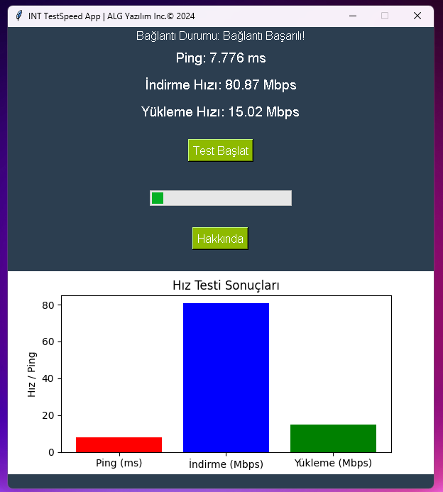

# SpeedTest-App
Cross Platform Speed Test Application Written in Python 

Install Git Clone and Python3

Github Package Must Be Installed On Your Device.
```bash
sudo apt install git -y
```
Python
```bash
sudo apt install python3 -y
```
----------Required Libraries----------

Tkinter
```bash
sudo apt-get install python3-tk
```

speedtest-cli
```bash
pip install speedtest-cli
```
matplotlib 
```bash
pip install matplotlib
```
Pillow (PIL)
```bash
pip install pillow
```

requests
```bash
pip install requests
```


----------------------------------
https://fatihonder.org.tr/internet-speedtest-app-yapimi/

# Installation
Install SpeedTest-App


```bash
sudo git clone https://github.com/cektor/SpeedTest-App.git
```
```bash
cd SpeedTest-App/
```

```bash
python speed.py
```
or

```bash
python3 speed.py

```

# To compile

NOTE: For Compilation Process pyinstaller must be installed. To Install If Not Installed.

pip install pyinstaller 

Linux Terminal 
```bash
pyinstaller --onefile --windowed speed.py
```

Windows VSCode Terminal 
```bash
pyinstaller --onefile --noconsole speed.py
```

MacOS VSCode Terminal 
```bash
pyinstaller --onefile --noconsole speed.py
```

# To run directly on Windows or Linux
Download and Run According to Your Operating System from the Link

https://github.com/cektor/SpeedTest-App/releases/tag/1.0


# Linux Screenshot

 

# Windows Screenshot

 

